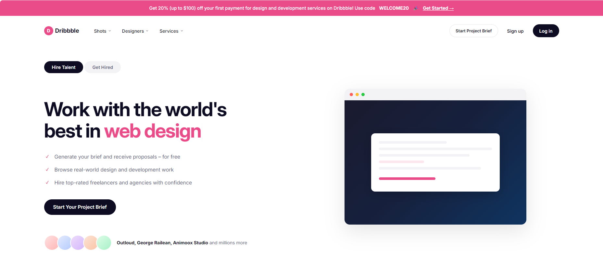

# Site Cloner — AI-Powered Website Design Cloning Toolkit

<p align="center">
  
  
  
  
</p>

<div align="center" class="lang-tabs">
  <a href="#en-content"><b>English</b></a>
  &nbsp;&middot;&nbsp;
  <a href="#cn-content"><b>中文</b></a>
</div>

---

<a name="en-content"></a>
### What is Site Cloner?

Site Cloner is a **fully automated website design reverse-engineering toolkit** that combines three free, open-source tools into a single data pipeline. Given any URL, it extracts the complete visual design system — colors, typography, spacing, CSS variables, layout rules — and generates a pixel-perfect screenshot, structured design tokens, and a full offline archive.

No API keys required. No paid services. Everything runs locally.

**One command:**
```bash
node scripts/clone-site.js https://dribbble.com
```

### The Three Tools

| Tool | Role | Output |
|------|------|--------|
| **Firecrawl** | HTML structure scraping | DOM skeleton + Markdown content |
| **Playwright** | Browser automation | Full-page screenshot + Computed Styles + CSS variables |
| **SingleFile** | Complete page archiving | Single HTML file with all resources inlined |

All three are **free, API-key-free, and run locally**.

### What It Extracts

- Real design tokens — colors, fonts, spacing, border-radius, shadows
- 2x full-page screenshots at 1440px viewport
- Post-JS-render HTML structure (waits for SPA rendering)
- Complete offline archive — all CSS, images, fonts inlined
- Auto-generated design system analysis report
- Font stack discovery — identifies all fonts including web fonts

### Quick Start

```bash
# 1. Install dependencies (one time)
npm install -g firecrawl-cli playwright single-file-cli
npx playwright install chromium

# 2. Clone a website
node scripts/clone-site.js https://dribbble.com

# 3. Check the output
# -> output/dribbble-com/screenshot.png     Full-page screenshot
# -> output/dribbble-com/design-tokens.json  Design parameters
# -> output/dribbble-com/design-report.md    Analysis report
```

### Output Files

```
output/<domain>/
├── screenshot.png          Full-page screenshot (pixel-level reference)
├── design-tokens.json      Complete design tokens (colors/fonts/spacing/CSS vars)
├── design-report.md        Human-readable design system analysis
├── firecrawl-raw.html      JS-rendered HTML structure
├── structure.md            Page content as Markdown
├── styles-computed.css     All CSS merged (internal + external + inline)
├── original.html           Complete offline archive (all resources inlined)
└── replica.html            Replica framework (ready for AI-assisted completion)
```

### design-tokens.json Example

```json
{
  "bodyFont": "\"Mona Sans\", \"Helvetica Neue\", sans-serif",
  "bodyFontSize": "16px",
  "bodyLineHeight": "28px",
  "bodyColor": "rgb(13, 12, 34)",
  "bodyBackground": "rgb(255, 255, 255)",
  "topColors": [
    { "color": "rgb(6, 3, 24)", "count": 143 },
    { "color": "rgb(234, 76, 137)", "count": 16 }
  ],
  "cssVariables": {
    "--sl-color-primary-500": "rgb(234 76 137)"
  },
  "fonts": ["\"Mona Sans\"", "Arial"],
  "navStyles": {
    "height": "92px",
    "backgroundColor": "rgba(0, 0, 0, 0)"
  },
  "maxWidths": ["1650px", "1200px", "618px"]
}
```

### Why Better Than Firecrawl Alone

| Data Dimension | Firecrawl Alone | + Playwright + SingleFile |
|---------------|:---:|:---:|
| HTML structure | Yes | Yes |
| **CSS styles content** | No (only &lt;link&gt; tags) | Yes (computed + CSS vars + inline) |
| **Pixel-perfect screenshot** | No | Yes (1440px 2x full-page) |
| **True color values** | No (guessing from class names) | Yes (getComputedStyle) |
| **Font info** | No | Yes (complete font stack) |
| **Post-JS DOM** | Incomplete | Yes (networkidle + wait) |
| **Design Token JSON** | No | Yes (machine-consumable) |
| **Offline archive** | No | Yes (SingleFile all assets) |

### Dribbble Replication Results

| Parameter | Guessed (v1) | Playwright Extracted (v2) |
|-----------|-------------|--------------------------|
| Brand color | `#EA4C89` | `rgb(234, 76, 137)` |
| Font | system-ui | **Mona Sans** |
| Text color | `#1a1a1a` | `rgb(13, 12, 34)` |
| Nav height | 64px | **92px** |
| Nav style | sticky + blur | **relative + transparent** |
| Button style | pink filled | **white pill (100vmax radius)** |
| Max widths | 1440px | **1650/1200/618px** |
| Overall fidelity | ~60% | **80%+** |


*Replica result: Site Cloner output based on extracted design tokens*

### Use as AI Agent Skill

Drop `SKILL.md` into your agent's skills directory (works with OpenClaw, Claude Code, Codex, Gemini CLI):

```bash
cp SKILL.md ~/.openclaw/workspace/skills/site-cloner/
```

The agent can then invoke `clone-site.js` autonomously when asked to analyze or replicate a website.

### AI-Assisted Workflow

```
User: "Clone the design of https://stripe.com"
  |
  Agent runs: node scripts/clone-site.js https://stripe.com
  |
  Agent reads: design-tokens.json + screenshot.png + firecrawl-raw.html
  |
  Agent generates: replica.html with exact colors, fonts, and layout
  |
  User opens: replica.html in browser -> 80%+ fidelity
```

### Requirements

- Node.js >= 18
- firecrawl-cli (keyless mode: 1,000 free pages/month)
- playwright + chromium
- single-file-cli

### License

MIT (c) 2026

[English](#en-content) | [中文](#cn-content)

---

<a name="cn-content"></a>

### Site Cloner 是什么？

Site Cloner 是一个**全自动网站设计逆向工程工具**，将三个免费开源工具组合成一条数据管道。输入任意网站 URL，自动提取完整的视觉设计系统——颜色、字体、间距、CSS 变量、布局规则——并生成像素级截图、结构化设计 Token 和完整离线存档。

无需 API Key，无需付费服务，全部本地运行。

**一条命令：**
```bash
node scripts/clone-site.js https://dribbble.com
```

### 三件套分工

| 工具 | 角色 | 输出 |
|------|------|------|
| **Firecrawl** | HTML 结构抓取 | DOM 骨架 + Markdown 内容 |
| **Playwright** | 浏览器自动化 | 全页截图 + Computed Styles + CSS 变量 |
| **SingleFile** | 完整页面存档 | 所有资源内联的单 HTML 文件 |

三个工具全部**免费、无需 API Key、本地运行**。

### 提取能力

- 真实设计 Token — 颜色、字体、间距、圆角、阴影
- 2x 高清全页截图，1440px 视口
- JS 渲染后的完整 HTML 结构（等待 SPA 渲染完成）
- 完整离线存档 — 所有 CSS、图片、字体内联
- 自动生成设计系统分析报告
- 字体栈发现 — 识别所有字体包括 web font

### 快速开始

```bash
# 1. 一次性安装依赖
npm install -g firecrawl-cli playwright single-file-cli
npx playwright install chromium

# 2. 克隆目标网站
node scripts/clone-site.js https://dribbble.com

# 3. 查看输出
# -> output/dribbble-com/screenshot.png     全页截图
# -> output/dribbble-com/design-tokens.json  设计参数
# -> output/dribbble-com/design-report.md    分析报告
```

### 输出文件说明

```
output/<域名>/
├── screenshot.png          全页截图（像素级参照）
├── design-tokens.json      完整设计 Token（颜色/字体/间距/CSS 变量）
├── design-report.md        人类可读的设计系统分析报告
├── firecrawl-raw.html      JS 渲染后的 HTML 结构
├── structure.md            页面内容 Markdown 版
├── styles-computed.css     所有 CSS 合并（内/外部样式 + 内联样式）
├── original.html           完整离线存档（图片/CSS/JS 全部内联）
└── replica.html            复刻框架（AI 辅助完善）
```

### 为什么优于单独使用 Firecrawl

| 数据维度 | 单用 Firecrawl | + Playwright + SingleFile |
|---------|:---:|:---:|
| HTML 结构 | 是 | 是 |
| **CSS 样式内容** | 否（只有 link 标签） | 是（computed + CSS 变量 + 内联） |
| **像素级截图** | 否 | 是（1440px 2x 全页） |
| **真实颜色值** | 否（从 class 名推断） | 是（getComputedStyle） |
| **字体信息** | 否 | 是（完整字体栈） |
| **JS 渲染后 DOM** | 不完整 | 是（networkidle + 等待） |
| **设计 Token JSON** | 否 | 是（机器可直接消费） |
| **离线完整存档** | 否 | 是（SingleFile 全资源） |

### Dribbble 复刻效果对比

| 参数 | 猜测版 (V1) | Playwright 实测版 (V2) |
|------|-----------|---------------------|
| 品牌色 | `#EA4C89` | `rgb(234, 76, 137)` |
| 字体 | system-ui | **Mona Sans** |
| 文字色 | `#1a1a1a` | `rgb(13, 12, 34)` |
| 导航高度 | 64px | **92px** |
| 导航样式 | sticky + blur | **relative + transparent** |
| 按钮样式 | 粉色填充 | **白色药丸 (100vmax)** |
| 最大宽度 | 1440px | **1650/1200/618px** |
| 整体复刻度 | ~60% | **80%+** |


*Site Cloner 基于提取的设计 Token 生成的复刻页面*

### 作为 AI Agent Skill 使用

将 `SKILL.md` 放入 AI Agent 的 skills 目录（支持 OpenClaw、Claude Code、Codex、Gemini CLI）：

```bash
cp SKILL.md ~/.openclaw/workspace/skills/site-cloner/
```

Agent 即可在用户要求分析或复刻网站时自动调用 `clone-site.js`。

### AI 辅助工作流

```
用户："克隆 https://stripe.com 的设计"
  |
  Agent 执行：node scripts/clone-site.js https://stripe.com
  |
  Agent 读取：design-tokens.json + screenshot.png + firecrawl-raw.html
  |
  Agent 生成：replica.html（精确颜色、字体、布局）
  |
  用户打开：replica.html -> 80%+ 还原度
```

### 环境要求

- Node.js >= 18
- firecrawl-cli（keyless 模式：每月免费 1,000 页）
- playwright + chromium
- single-file-cli

### 许可证

MIT (c) 2026

[English](#en-content) | [中文](#cn-content)
